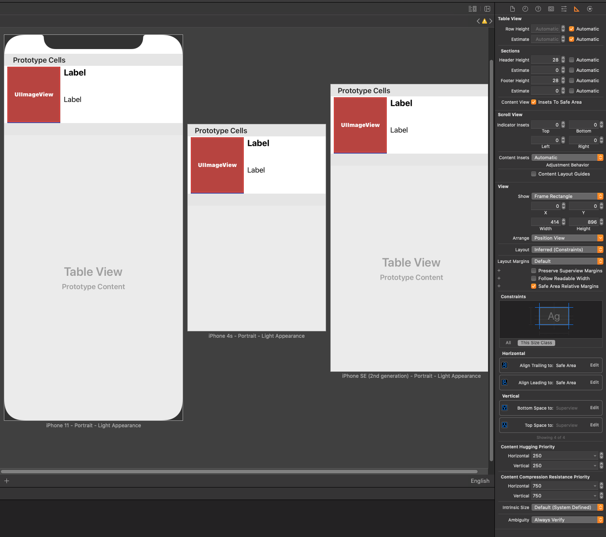

# Flixster Movie App

### Part 2, Final App Walkthrough GIF w/ Bonus
 

##  Flix Part 2

### User Stories

#### REQUIRED (10pts)
- [x] (5pts) User can tap a cell to see more details about a particular movie.
- [x] (5pts) User can tap a tab bar button to view a grid layout of Movie Posters using a CollectionView.

#### BONUS
- [x] (2pts) User can tap a poster in the collection view to see a detail screen of that movie.
- [x] (2pts) In the detail view, when the user taps the poster, a new screen is presented modally where they can view the trailer.

### App Walkthrough GIF

 

### Notes
- While developing, I had a problem with the collection view. Within it, my images first appeared to be very small. I tried to make sure the image view within the cell and the collection view itself were of the appropriate sizes. But even after rewatching the video, the issue persisted. To rectify this problem, I needed to go to the collection view and change "Estimate Size" to None.

##  Flix Part 1

### User Stories - What will our app do?

#### Required User Stories (10 pts)
- [x] User sees an app icon on the home screen and a styled launch screen.
- [x] User can view and scroll through a list of movies now playing in theaters.
- [x] User can view the movie posters in each row.

#### Bonus User Stories
- [x] User can view the app on various device sizes and orientations.
- [x] Run your app on a real device (gif is run on real device and loaded below).

### Walkthrough Gif

### Notes
- During this project, I had the biggest challenge with installing Alamofire and OAuthSwift pods. 
- In my app, I also removed the colored background for poster images, but it didn't remove itself in the preview on the device.
- After using a physical device to preview the app, I also noticed that XCode no longer showed a computer preview for a generated device. 
- I also tried the bonus and noticed much of the menu for constraints had changed. XCode gave me a few suggestions for the constraints and I followed the instructions as much as I could, making sure to include automatic row height instead of the hard coded value. See image below:

